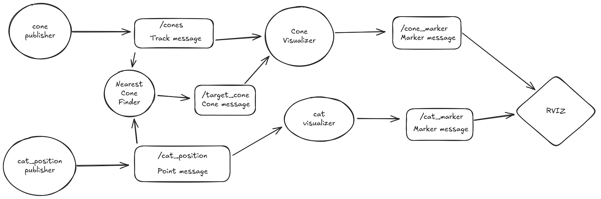

# Driverless Intro

## Prerequisites

### ROS 2 Installation

The package is designed for ROS 2 (Humble Hawksbill is recommended).

Ensure ROS 2 is installed and properly configured on your system.

Follow the [official ROS 2 installation guide](https://docs.ros.org/en/humble/Installation.html) for your operating system. The installation and usage of ros2 is generally the easiest on [Ubuntu 22](https://releases.ubuntu.com/jammy/), so it is heavily recommended. For this reason this README assumes the usage of a debian based linux distribution.

### Build Tools

- CMake: Version 3.8 or higher is required.

- C++ Compiler: gcc or clang 

```bash
sudo apt install g++ cmake
```

- Python: Python 3.6 or higher is required for the Python nodes.
```bash
sudo apt install python3
```

- Setuptools: Required for Python package installation.

```bash
pip install setuptools
```

- Colcon: Required ros2 build tool

```bash
sudo apt install python3-colcon-common-extensions
```

### Dependencies

The following ROS 2 packages are dependencies for this package. They should be installed in your ROS 2 workspace:

- rclcpp: C++ client library for ROS 2.

- rclpy: Python client library for ROS 2.

- std_msgs: Standard ROS 2 message types.

- geometry_msgs: ROS 2 messages for geometric primitives.

- rosidl_default_generators: Tools for generating ROS 2 interfaces.

- rosidl_default_runtime: Runtime support for ROS 2 interfaces.

You can install them using the [rosdep dependency manager](https://docs.ros.org/en/humble/Tutorials/Intermediate/Rosdep.html). Alternatively you can install them manually on Linux using apt:

```bash
sudo apt install ros-humble-rclcpp ros-humble-rclpy ros-humble-std-msgs ros-humble-geometry-msgs ros-humble-rosidl-default-generators ros-humble-rosidl-default-runtime
```

## General Ros stuff

This package, as all other ros2 packages, should sit in your ros2_ws/src folder!
If you work from the terminal with a ros package you should always be inside of the root folder (in this case ros2_ws).

To build (compile) a ros2 package you just need to build *from the root folder*, for which you first need to source your humble installation:
```bash
source /opt/ros/humble/setup.bash
colcon build
```

After building you should now have a log, install and build directory in addition to the src directory. 
You can now source the package doing this while you are in the root directory:
```bash
source install/setup.bash
```

You can now use this package by starting a [launch file](#driverless_intro/launch).

(If you are using sh or zsh instead of bash change the source command accordingly)

## Package Overview

This package contains both python and c++ nodes:

```bash
.
└── src
    └── driverless_intro
        ├── CMakeLists.txt
        ├── docs
        ├── driverless_intro
        │   ├── cat_position.py
        │   ├── cat_visualizer.py
        │   ├── cone_visualizer.py
        │   └── __init__.py
        ├── launch
        │   ├── cat_finder.launch.py
        │   └── driverless_intro.launch.py
        ├── meshes
        │   └── cat.dae
        ├── msg
        │   ├── Cone.msg
        │   └── Track.msg
        ├── package.xml
        ├── setup.py
        ├── src
        │   ├── cone_publisher.cpp
        │   └── nearest_cone.cpp
        └── tracks
            ├── acceleration.csv
            └── FSG.csv
```



Round nodes in this graph stand for ros2 nodes. 
Rectangular nodes in this graph stand for ros2 topic.

### driverless_intro/docs

This directory contains the task descriptions as well as images.

### driverless_intro/driverless_intro

This directory contains the python nodes, which are mainly used for visualization in rviz:

- *cat_position.py*
    The cat position node generates a random point on the track and publishes it to the /cat_position topic. It is started via the [cat_finder.launch.py](launch/cat_finder.launch.py) launch file.

- *cat_visualizer.py*
    This cat visualizer node subscribes to the /cat_position topic and publishes a cat marker to the /cat_marker topic in form of the [cat 3d model](meshes/cat.dae) for visualization in rviz.
    It is started via the [cat_finder.launch.py](launch/cat_finder.launch.py) launch file.

- *cones_visualizer.py*
    This cone visualizer node subscribes to the /cones topic and the /target_cone message publishes the cones to the /cone_marker topic for visualization in rviz. If a target cone message is received, the cone is marked red in rviz.
    It is started via the [cat_finder.launch.py](launch/cat_finder.launch.py) and the [driverless_intro.launch.py](launch/driverless_intro.launch.py) launch file.

Take a look at the RVIZ guide in the [Task Description](docs/task_description.md) to see how to see the markers in rviz.

### driverless_intro/launch

The launch directory contains two launch files:

- **driverless_intro.launch.py**:
    This launch can be started in your root folder by via:
    ```bash
    ros2 launch driverless_intro driverless_intro.launch.py
    ```
    If you want the acceleration track instead you can specify it doing:
    ```bash
    ros2 launch driverless_intro driverless_intro.launch.py track_file:=acceleration.csv
    ```

    This launch file starts rviz, the cone publisher and the cone visualizer node.

- **cat_finder.launch.py**:
    This launch can be started in your root folder by via:
    ```bash
    ros2 launch driverless_intro cat_finder.launch.py
    ```
    If you want the acceleration track instead you can specify it doing:
    ```bash
    ros2 launch driverless_intro cat_finder.launch.py track_file:=acceleration.csv
    ```

    This launch file starts rviz, the cone publisher and the cone visualizer node, as well as the cat position, cat visualier and the nearest cone node.

Keep in mind that you need to source the package before being able to use the launch files.

### driverless_intro/meshes

This directory contains the cat 3d model, which is used in the cat visualizer node.

### driverless_intro/msg

This directory contains custom messages which can be send to other nodes via topics. In it the following messages are defined:

- Cone message
It contains the position, colour and whether it is knocked over. It is used in the Track message, nearest cone node and the cone visualizer node.

- Track message
It contains an array of Cones as defined in the Cone message. It is used in the cone publisher node and in the cone publisher.

### driverless_intro/src

This directory contains the c++ nodes of this package that still need completion:

- cone_publisher.cpp
This file contains the incomplete implementation of the cone publisher node. It should read a csv file from the tracks directory, specified via launch argument (see launch) and then construct cones of each line. It publishes the array to the /cones topic as a track message (which is visualized by the cone visualizer node).

- nearest_cone.cpp
This file contains the incomplete implementation of the nearest cone finder node. It subscribes to the /cones topic for the cone array and to the /cat_position topic for the cat coordinates. The  logic for finding the cone nearest to the cat position has to be added. It publishes the resulting cone to the /target_cone topic, where it is used by the cone visualizer to mark the target cone red.

### driverless_intro/tracks

This directory contains csv files describing the track:

- acceleration.csv: describes an acceleration track 
- FSG.csv: describes a trackdrive track from FS Germany

The tracks are in the format:
```csv
color,pose,name
blue,-1.20535457134 -2.43421959877 0 0 0 0,cone_right_0
```

The pose is made up of x, y, z, roll, pitch, yaw but only x and y are needed for this package. (See [Wikipedia](https://en.wikipedia.org/wiki/Euler_angles) for more information).

### Package description & dependency files

The package.xml contains meta information such as the project description as well as general dependencies. As this is a mixed python & cpp project there is both a CMakeList.txt and a setup.py. 

The setup.py is mostly used for the entrypoints for the python node. It looks like this because the compiled executable is placed into the build folder, which is why data files are specified as well.

The CMakeList is used for the compilation of the cpp nodes. As it is a mixed packages this file is used for building the code in the project (In purely python based packages you wouldnt need it). It specifies where everything is located and should be installed to.
It also specifies that this package uses custom messages which need to be build.