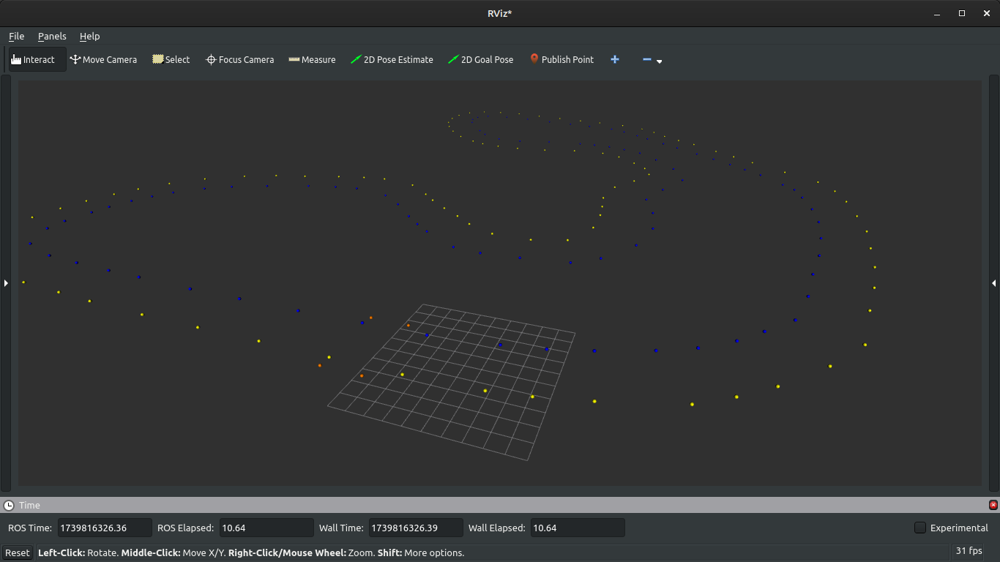
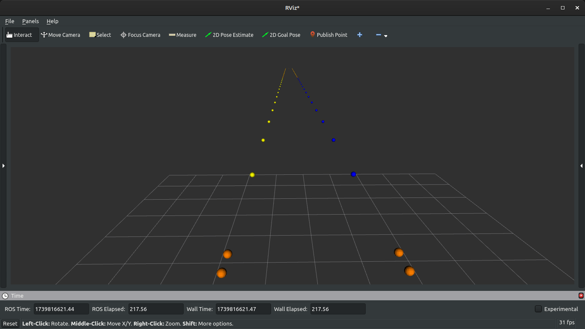
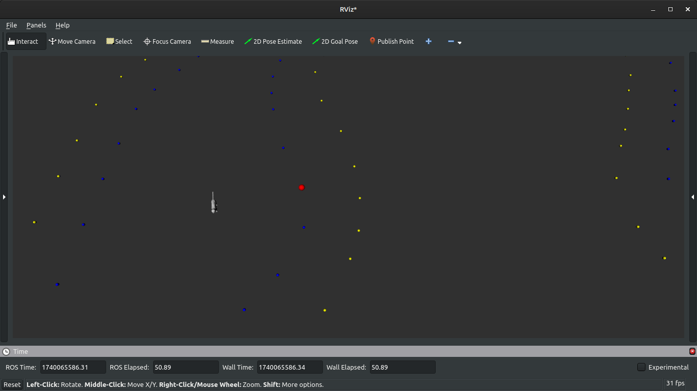
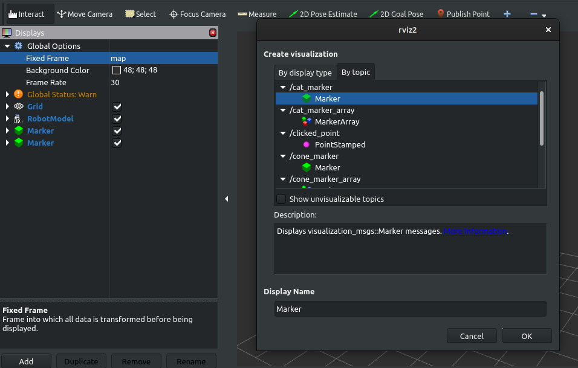
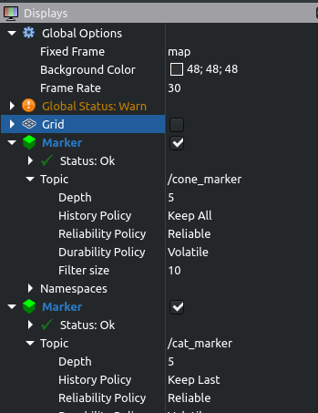

# Task Description

**The FSG Underberg Caper**

It was a sunny summer day at the Formula Student Germany (FSG) event, and the Bremergy team was buzzing with excitement. Their autonomous car was ready, the track was set, and the team was moments away from their first run. But there was one problem — their lucky bottles of Underberg was missing.

Unbeknownst to the team, Mittens, the mischievous paddock cat, had struck again. Earlier that morning, she had sauntered into the team's tent, her golden eyes locking onto the shiny green bottle. With a swift paw, she knocked it off the table and batted it across the floor. Then, with the bottles clutched in her teeth, she darted outside, weaving through the sea of cones scattered across the paddock.

Mittens had always been fascinated by the bright color of the cones. To her, they were the perfect hiding spots. She carefully tucked the Underberg beneath one of them, then lounged nearby, basking in the sun and watching the chaos unfold.

Help the team find their Underberg!

## Task 1

In this first task yoe need to create a map of the track.

You need to parse the csv files containing the track information.
Take a look at the [acceleration.csv](../tracks/acceleration.csv) and the [FSG.csv](../tracks/FSG.csv). A cone consists of color, pose and name. In the pose there is the x, y, z positions as well as roll, pitch, yaw orientations.

You need to implement the color_to_type function and the read_csv function in [cone_publisher.cpp](../src/cone_publisher.cpp). Make sure to keep the function signatures as they are. 

Take a look at the [README](../README.md) for information on how to compile and run the nodes.

Take a look at the [RVIZ guide](#how-to-use-rviz-for-this-task) to see how to visualize the cones.

If you did it successfully you should see the track:



Acceleration:


## Task 2

If you start the [cat_finder launch file](../launch/cat_finder.launch.py) you can now see the cat on the track near the cones.

You need to complete the findNearestCone() function in nearest_cone.cpp to find the cone closest to Mittens (which is likely where the Underberg is located).

If you did it successfully the cone closest to Mittens should be highlighted red:




## Hints

### Task 1

You only need to construct a cone and push it into the _cones vector.
The vector is regularly published so you dont need to publish it yourself.
A cone can be built via:
```cpp
driverless_intro::msg::Cone cone_msg;
cone_msg.position.x = x;
cone_msg.position.y = y;
cone_msg.position.z = z;
cone_msg.type = color_to_type(color);
cone_msg.knocked_over = false;
```

Take a look at the Cone message in msg/Cone.msg:
```cpp
geometry_msgs/Point position #x,y,z [m] wrt to the car start location (origin)
uint8 type # use the enum below
bool knocked_over # is cone knocked over
# Constants
uint8 BLUE=0
uint8 YELLOW=1
uint8 ORANGE_BIG=2
uint8 ORANGE_SMALL=3
uint8 UNKNOWN=4
```

As you can see, the color of our cones is a uint8.
You can get the type of each cone color using the enum constants: `driverless_intro::msg::Cone::BLUE;`

### Task 2

Keep in mind that this is already declared which is all you need:
```cpp
geometry_msgs::msg::Point cat_position_;
std::vector<driverless_intro::msg::Cone> cones_;
bool cat_position_received_ = false;
```

Like in task 1 you can initialize a Cone via:
```cpp
driverless_intro::msg::Cone nearest_cone;
```

From the cones and the cat position you can get the x, y and z coordinates in the same way as before:

```cpp
double cat_x = cat_position_.x;
double cat_y = cat_position_.y;
double cat_z = cat_position_.z;

double cone_x = cone.position.x;
double cone_y = cone.position.y;
double cone_z = cone.position.z;
```

This time you need to publish you result yourself which is pretty simple.
After finding the correct cone it can be published via:
```cpp
target_cone_pub_->publish(nearest_cone);
```

The function is called every time a cat position message or track message is received, so make sure to check if both cones and cat position have been received yet first.

## How to use RVIZ for this task

RVIZ is used to visualize topic data in ros2.

All our topic data is published on the map frame. To see our topic data, we need to set the frame to map if it isnt set as that already. You can do that by clicking to the field right next to the Fixed Frame Global Options.

To see the markers you need to add them by clicking on "Add" -> "By topic" and selecting the cat_marker and the cone_marker:
.

Make sure that the cone marker has a history policy of "Keep All" so that all cones are kept visualized without issue. You can do that by opening the drop down menu for "Marker" and then for "topic".

The settings for RVIZ should look like this:



You can also move the camera on the right side in rviz if you want.